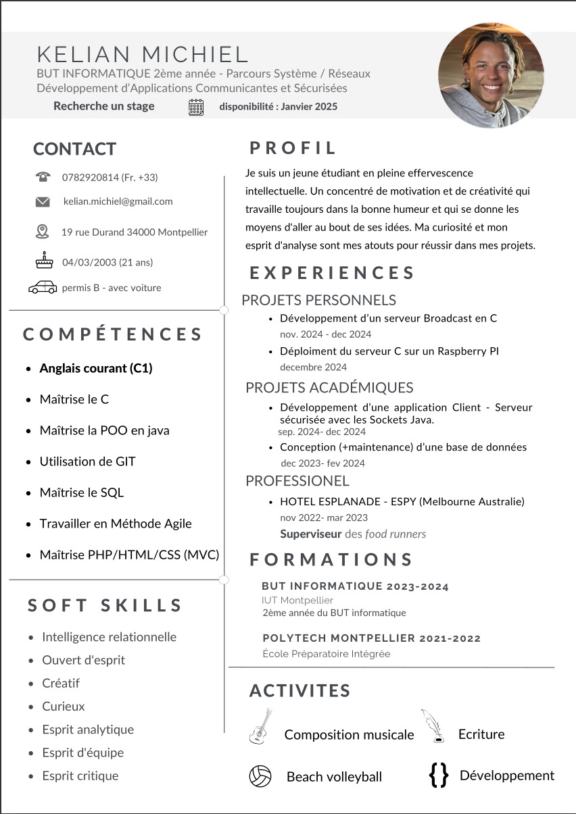

---
# don't change
type: misc

# change these
jobTitle: Développeur Système Embarqué
name: Kelian Michiel
bio: true
icon: ":coffee:"
---

✨ Je suis un jeune étudiant en pleine effervescence intellectuelle. Un concentré de motivation et de créativité qui travaille toujours dans la bonne humeur et qui se donne les moyens d'aller au bout de ses idées. Ma curiosité et mon esprit d'analyse sont mes atouts pour réussir dans mes projets. ✨

💻 Mon parcours 💻

J’ai commencé en 2021 une école préparatoire intégrée où j’ai appris à coder en C et en python. Suite à cette première année, j’ai su que l’informatique était ce qui me plaisait le plus. J’ai cependant décidé de prendre une année de césure en Australie où j’ai pu parfaire mon anglais et découvrir de nouvelles cultures. A mon retour en France j’étais déterminé à reprendre les études pour pouvoir travailler dans un domaine que j’aime et qui m’anime. Je me suis alors réorienté en BUT informatique pour enrichir mes connaissances dans ce milieu. Grâce à cette formation, j’apprends de nouvelles choses de jour en jour et compte bien continuer sur ma lancée.

Je suis intéressé par le développement, mais surtout par le fonctionnement des machines. La robotique m’a toujours passionné et quoi de mieux que les systèmes embarqués pour combiner le développement et le fonctionnement des machines ? ✨

En effet, j'ai toujours été attiré par ce milieu. Mon souhait serait de continuer mes études après mon BUT, et de développer des compétences dans des langages bas niveau pour pouvoir développer des systèmes embarqués notamment en Rust. J’aimerais continuer mon parcours en effectuant un master en robotique par exemple. 📚

