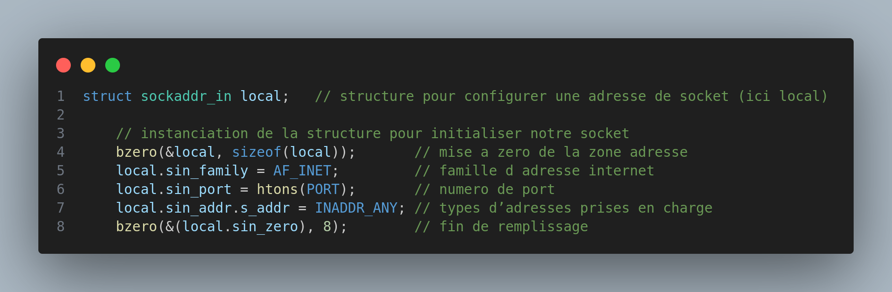
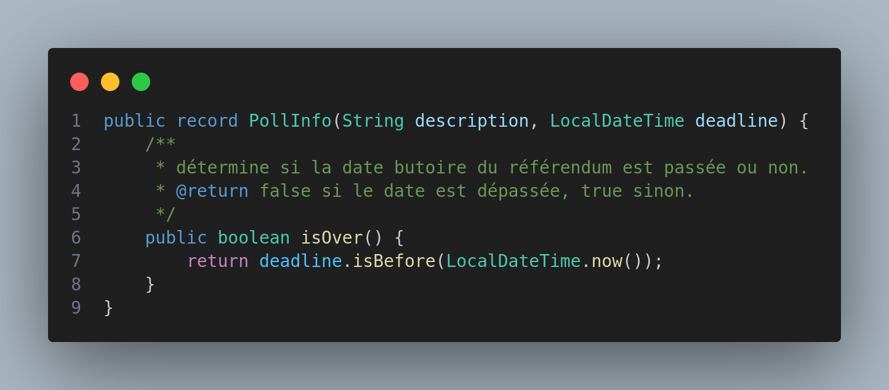
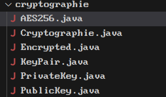
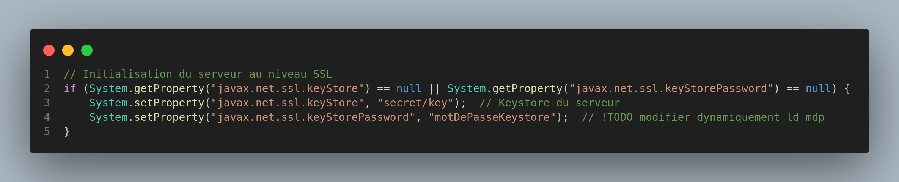
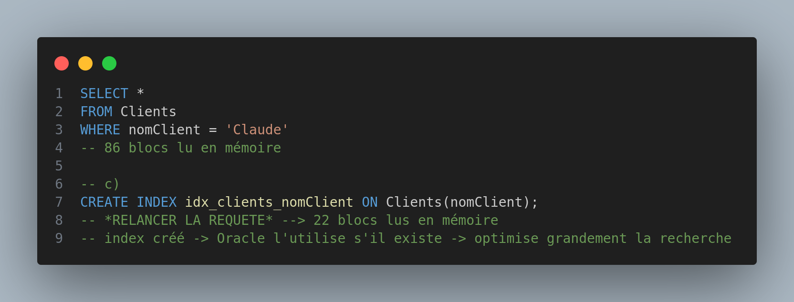
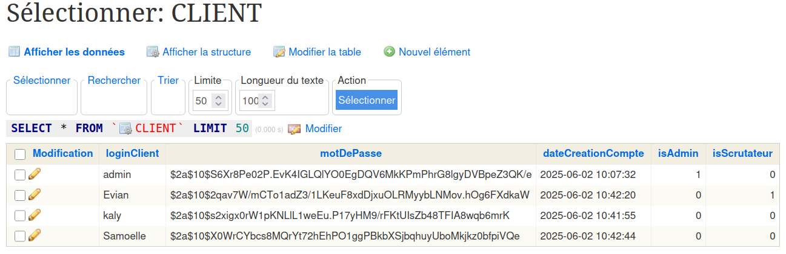

Pour chaque apprentissage critique, vous trouverez chaque projet qui démontre mon niveau avec un texte descriptif ainsi que les traces associées.

Le niveau suivra l'échelle suivante : **Non-Acquis ⭢ En cours d'acquisition ⭢ Acquis**

## Compétence n°2 : Optimiser des applications

### AC1 : Choisir des structures de données complexes adaptées au problème
**Niveau :** Acquis\
**Projets en relation :** [NeufCord](../../projets/neufcord), [Voteomatic](../../projets/voteomatic)\
**Traces :**

#### Structure d'adressage TCP/IP en C:
\
La structure *sockaddr_in* utilisée permet de créer un socket TCP/IP et de le connecter à une adresse IP et un port spécifiés.

#### Classe Record en java :
\
Cette classe en java permet de créer des objets à titre informatif. Ce sont des classes dites immuables, leurs paramètres ne peuvent être changés. Le comportement des objets créés n'évolue pas mais leur statut reste inchangé.

### AC2 : Utiliser des techniques algorithmiques adaptées pour des problèmes complexes
**Niveau :** En cours d'acquisition\
**Projets en relation :** [Voteomatic](../../projets/voteomatic)\
**Traces :**

#### Factory (Pattern GOF) :

Ce pattern à été utilisé dans le but d'encapsuler la logique de création complexe des différents signaux, évitant la duplication de code et centralisant les règles de création. Deuxièmement, il facilite la maintenance, l'ajout d'un nouveau type de signal ne nécessite que l'ajout d'une nouvelle classe et la mise à jour de la fabrique, sans modifier le code client existant. Troisièmement, il améliore la robustesse du système en garantissant que tous les signaux sont créés de manière cohérente et validés correctement.

### AC3 : Comprendre les enjeux et moyens de sécurisation des données et du code
**Niveau :** Acquis\
**Projets en relation :** [Voteomatic](../../projets/voteomatic)\
**Traces :**

#### Cryptographie à clé publique :

La cryptographie à été utilisée dans le contexte de la sae Voteomatic. Celle-ci nous a permis de sécuriser les données transférées sur le réseau.

#### Certificat SSL/TLS :

Les certificats SSL/TLS ont eux aussi été utilisés dans le contexte de la sae Voteomatic. Ils nous ont permis d'assurer l'authenticité du destinataire. Ils nous permettent d'être sur que les données vont à une personne connue par le réseau.

### AC4 : Évaluer l’impact environnemental et sociétal des solutions proposées
**Niveau :** En cours d'acquisition\
**Trace :**
Je suis consciencieux quant à mon impact environnemental. Je n'utilise que très peu l'IA et favorise les recherches internet à tout prix. De plus, je cherche toujours à optimiser mes applications pour éviter la surconsommation en terme de performances. Je ne cerne cependant pas l'impact sociétal que peuvent avoir mes solutions..

## Compétence n°4 : Gérer des données de l’information

### AC1 : Optimiser les modèles de données de l’entreprise
**Niveau :** En cours d'acquisition\
**Traces :**
Cette compétence à été principalement travaillée lors des tds de base de données. Nous avons pu travailler de nombreux points dont :
- Normalisation des données (Forme normales, BCNF)
- Création d'indexes
- Optimisation des requêtes
- création de vues (matérialisées et non matérialisées), de triggers
- développement de procédures stockées, de fonctions
- création de tables temporaires

### AC2 : Assurer la confidentialité des données (intégrité et sécurité)
**Niveau :** Acquis\
**Projets en relation :** [Voteomatic](../../projets/voteomatic)
**Trace :**
Cette compétence à été travaillée lors de la conception de l'application Voteomatic. En effet, cette application traitait des données personnelles des utilisateurs possédant un compte. Il a donc fallu anonymiser les données pour éviter toute violation de confidentialité et par la même occasion du RGPD.

On observe ici les données concernant les utilisateurs qui sont anonymisées à l'aide d'une fonction de hachage. Cette capture d'écran est issue de la base de données de l'application, l'administrateur n'a donc pas directement accès aux données utilisateur.

### AC3 : Organiser la restitution de données à travers la programmation et la visualisation
**Niveau :** Acquis\
**Trace :**
// parler des requêtes php ?

### AC4 : Manipuler des données hétérogènes
**Niveau :** Acquis\
**Trace :**
// TODO

## Compétence n°5 : Conduire un projet

### AC1 : Identifier les processus présents dans une organisation en vue d’améliorer les systèmes d’information
**Niveau :** Acquis\
**Projets en relation :** [Voteomatic](../../projets/voteomatic)
**Trace :**
Cette compétence à été acquise lors de la sae Voteomatic. En effet, cette sae consiste à créer une application de vote en ligne pour améliorer le SI de notre client. Grâce à cette application, le client sera en mesure de récupérer l'avis de ses employés et ainsi collecter des informations précieuses sur leurs préférences et leurs attentes.

### AC2 : Formaliser les besoins du client et de l’utilisateur
**Niveau :** Acquis\
**Projets en relation :** [Voteomatic](../../projets/voteomatic)\
**Trace :**
J'ai été Product Owner pendant 2 semestre de SAE. Mon rôle à été de retranscrire les besoins du client et les besoins utilisateurs au travers de la méthode agile (SCRUM).

### AC3 : Identifier les critères de faisabilité d’un projet informatique
**Niveau :** Acquis\
**Projets en relation :** [Voteomatic](../../projets/voteomatic)\
**Trace :**
Au même titre que de formaliser les besoins du client et de l'utilisateur, identifier les critères de faisabilité faisait aussi partie de mon rôle indirectement. Cette tâche est associée au SCRUM Master, cependant, le SCRUM Master et le Product Owner prennent les décisions en ce qui concerne la faisabilité.

### AC4 : Définir et mettre en œuvre une démarche de suivi de projet
**Niveau :** Acquis\
**Projets en relation :** [Voteomatic](../../projets/voteomatic), [Stage chez HORIBA](../../projets/stm32)\
**Trace :**
Grâce à la mise en pratique des méthodes agiles durant deux semestre de SAE. J'ai pu mettre en oeuvre avec mes camarades une démarche de suivi de projet. Organisant régulièrement des daily meetings, des review de sprint, des rapports, etc. Tout cela s'inscrit dans un cadre universitaire certes mais j'ai aussi pu appliquer ces compétences lors de mon stage en milieu professionnel à l'aide d'un <a href="https://drive.google.com/drive/folders/1WITz6bwMdWwbzd9JAF_zHwcXl0M0_NGR?ths=true" target="_blank">diagramme de Gantt</a>

